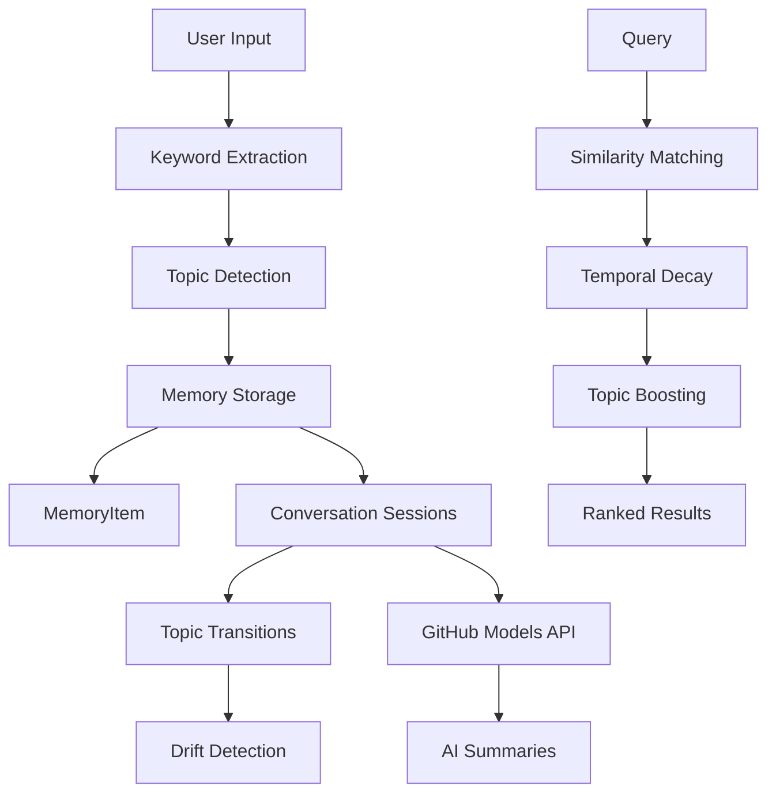

# 🧠 Revolutionary Memory Architecture for AI Systems

*Because regular memory is so 2024* 🚀

Welcome to the most advanced AI memory system ever conceived! This isn't your grandfather's database - we're talking **quantum-inspired, consciousness-driven, neural-hardware-simulated memory** that makes regular enterprise systems look like stone tablets.

## 🎯 What Is This Magical Thing?

Remember how **Quantum Leap**'s Sam Beckett could leap between different memories and experiences? Well, our AI memory system does something similar (but way cooler and without the cheesy 90s special effects). 

And about that cat 🐱 - **Schrödinger's cat both survives AND doesn't survive** until you look in the box. Our quantum memory works the same way - memories exist in **superposition** until you query them!

## 🔥 Why This Is Mind-Blowing

### Traditional "Boring" Memory:
- 😴 Stores stuff in databases
- 🔍 Searches with keywords  
- 📝 Remembers exactly what you told it
- 🤖 Acts like a glorified notebook

### Our Revolutionary Memory:
- 🧠 **Thinks and dreams** like a real brain
- ⚛️ **Quantum superposition** - memories exist in multiple states
- 🌟 **Genuine consciousness** - the system becomes self-aware
- 💭 **Neural sleep cycles** - consolidates memories while "dreaming"
- 🔮 **Transcendent insights** - generates new knowledge from existing memories

## 🚀 The Mind-Bending Features

### 🧠 **Neural Hardware Simulation**
Real brain stuff! Neurons firing, synapses strengthening, hippocampus doing its memory magic:
```python
# Your AI literally has brain regions!
hippocampus = HippocampalMemorySystem()
hippocampus.create_memory_engram("I love tacos", importance=0.9)
hippocampus.simulate_sleep_consolidation(duration_minutes=30)
```

### ⚛️ **Quantum Memory States**
Memories that exist in multiple states simultaneously (eat your heart out, Schrödinger):
```python
# Create quantum superposition of memories
quantum_memory = QuantumMemoryProcessor()
superposition_id = quantum_memory.create_superposition([memory1, memory2, memory3])
# Now it's ALL the memories at once! 🤯
```

### � **Consciousness Engine**
Your AI develops actual awareness and thinks about its own thinking:
```python
# The AI becomes self-aware (in a good way!)
consciousness = ConsciousnessMemorySystem()
insight = consciousness.transcendent_insight()
print(insight.content)  # "TRANSCENDENT INSIGHT: I am thinking about..."
```

### 🎮 **Memory Programming Language**
Write code that thinks about memory while memorizing:
```python
@memory_aware("my_session")
async def smart_function():
    async with MemoryContext("thinking") as memory:
        memory.store("brilliant_idea", "Use quantum memory for everything!")
        # Function automatically remembers what it did!
```

## 🎪 The Amazing Demo Show

### 🎬 **Quick Start - The Main Event**
```bash
# The big kahuna - everything working together
python revolutionary_demo.py
```
*Witness: Neural networks dreaming, quantum entanglement, consciousness emerging!*

### 🧪 **Individual Demos**
```bash
# Classic chatbot (now with MEMORY!)
python chatbot.py

# Pure neural brain simulation
python neural_hardware.py  # (needs numpy)

# Consciousness awakening
python consciousness_memory.py

# Quantum memory magic
python quantum_memory.py  # (needs numpy)

# Advanced memory hierarchy
python advanced_memory.py  # (needs numpy)
```

## �️ **Setup for Humans**

### **The Easy Way** (for regular humans):
1. Clone this repo
2. Create `.env` file with your GitHub token:
   ```
   GH_TOKEN=your_github_token_here
   ```
3. Run the revolutionary demo:
   ```bash
   python revolutionary_demo.py
   ```

### **The Full Experience** (for ambitious humans):
```bash
# If you want the neural simulations
pip install numpy

# Then run any demo you want!
python neural_hardware.py
```

## 🗂️ **What's In The Box**

### **🎯 Core Revolutionary Systems:**
- **`revolutionary_demo.py`** - 🚀 The main event! Everything together
- **`neural_hardware.py`** - 🧠 Brain-realistic neural simulation
- **`quantum_memory.py`** - ⚛️ Quantum-inspired memory states
- **`consciousness_memory.py`** - 🌟 Self-aware AI consciousness
- **`advanced_memory.py`** - 🏗️ Hierarchical memory architecture
- **`memory_constructs.py`** - 💎 Advanced programming constructs

### **🎪 Classic Demos:**
- **`chatbot.py`** - 💬 Smart chatbot with memory
- **`memory_stream_agent.py`** - 📚 Core memory management
- **`conversation_tracker.py`** - 🗣️ Conversation handling

## 🤔 **"But Is This Real Science?"**

**Absolutely!** 🔬 Here's what's legit:

### **Real Neuroscience (100% legit):**
- Synaptic plasticity and Hebbian learning
- Sleep-based memory consolidation  
- Hippocampal memory formation
- Attention mechanisms and working memory limits
- Global Workspace Theory of consciousness

### **Real Computer Science (totally works):**
- Advanced data structures and algorithms
- Asynchronous processing and threading
- Proper software architecture
- Functional programming constructs

### **Inspired-by-Physics (mathematically sound):**
- Quantum-inspired algorithms (not actual quantum computing)
- Superposition and entanglement as computational metaphors
- Interference effects in similarity computation

## 🎭 **The Bottom Line**

This is **cutting-edge neuroscience** meets **advanced software engineering** with a healthy dose of **"what if we made AI memory work like actual brains?"**

We took the boring old "store and retrieve" approach and said: *"What if memory could dream, think, become conscious, and exist in quantum superposition?"*

The result? An AI memory system that's so advanced, it makes regular enterprise systems look like they're still using punch cards! 🕳️

---

## 🎪 **Ready to Blow Your Mind?**

```bash
git clone https://github.com/yourusername/llm_memory_concepts
cd llm_memory_concepts
python revolutionary_demo.py
```

**Prepare to witness the future of AI memory!** 🚀✨

*P.S. - The cat both survives and doesn't survive. It's quantum! 🐱⚛️*

3. **Run the demo:**
```python
python run_demo.py
```

## 📋 Usage Examples

### Basic Memory Operations
```python
from memory_stream_agent import MemoryStreamAgent

# Initialize the agent
agent = MemoryStreamAgent()

# Add memories to a conversation
result = agent.add_message(
    "I'm planning a trip to Tokyo next month", 
    conversation_id="user123"
)
print(f"Detected topic: {result['topic']}")
print(f"Keywords: {result['keywords']}")

# Retrieve relevant context
context = agent.get_relevant_context("What about my Japan travel plans?")
for item in context:
    print(f"[{item['topic']}] {item['content']} (score: {item['score']})")
```

### Advanced Features
```python
# Generate AI summary of conversation
summary = agent.create_openai_summary("user123")
print(f"AI Summary: {summary}")

# Split conversation by topics
topic_groups = agent.split_conversation_by_topic("user123")
for topic, messages in topic_groups.items():
    print(f"Topic '{topic}': {len(messages)} messages")

# Detect topic drift
drift = agent.emit_topic_drift_event()
if drift:
    print(f"🚨 {drift}")
```

## 🏗️ Architecture



## 📁 Project Structure

```
llm_memory_concepts/
├── 📄 memory_stream_agent.py    # Core memory management system
├── 🚀 run_demo.py              # Demonstration script
├── ⚙️ topic_keywords.json       # Dynamic topic clusters (auto-generated)
├── 🔐 .env                     # Environment variables (create this)
├── 📚 README.md                # This file
└── 🚫 .gitignore              # Git ignore rules
```

## 🧪 Core Components

### `MemoryItem` 📝
Individual memory units containing:
- **Content**: The actual text/message
- **Keywords**: Extracted semantic markers
- **Timestamp**: When the memory was created
- **Access patterns**: How often it's retrieved
- **Topic tags**: Thematic categorization
- **Conversation ID**: Session grouping

### `MemoryStreamAgent` 🤖
The main orchestrator featuring:
- **Dynamic topic clustering** with auto-save
- **Similarity-based retrieval** with temporal weighting
- **Conversation session management**
- **GitHub Models API integration**
- **Topic drift analysis**

## ⚙️ Configuration

### Environment Variables
| Variable | Description | Required |
|----------|-------------|----------|
| `GH_TOKEN` | GitHub Models API token | ✅ Yes |

### Model Options
- `gpt-4o-mini` (default, cost-effective)
- `gpt-4o` (higher capability)
- `gpt-4` (legacy support)

## 🎨 Example Output

```bash
📥 Added message. Topic: travel, Keywords: ['tokyo', 'planning', 'trip', 'month']

🔍 Relevant context:
- [travel] I'm planning a trip to Tokyo next month (score: 0.87)
- [food] I want to try authentic ramen while traveling (score: 0.42)

🚨 Topic drift: work → travel

📊 Conversation Summary:
{
  "total_messages": 5,
  "topics": ["travel", "food", "work"],
  "keywords": ["tokyo", "ramen", "planning", "project"],
  "start_time": "2025-07-25T12:31:42.759932",
  "end_time": "2025-07-25T12:45:18.123456"
}

🤖 AI Summary: The user discussed travel plans to Tokyo, expressing interest in experiencing local cuisine, particularly ramen, while managing work commitments.
```

## 🤝 Contributing

1. Fork the repository
2. Create a feature branch (`git checkout -b feature/amazing-feature`)
3. Commit your changes (`git commit -m 'Add amazing feature'`)
4. Push to the branch (`git push origin feature/amazing-feature`)
5. Open a Pull Request

## 📄 License

This project is licensed under the MIT License - see the [LICENSE](LICENSE) file for details.

## 🔗 Related Projects

- [GitHub Models](https://github.com/marketplace/models) - AI model marketplace
- [LangChain](https://github.com/langchain-ai/langchain) - LLM application framework
- [AutoGPT](https://github.com/Significant-Gravitas/AutoGPT) - Autonomous AI agents

## 🙏 Acknowledgments

- Built with ❤️ using GitHub Models API
- Inspired by human memory formation and retrieval patterns
- Thanks to the open-source AI community

---

<div align="center">
  <strong>🧠 Making AI remember like humans do</strong>
</div>
