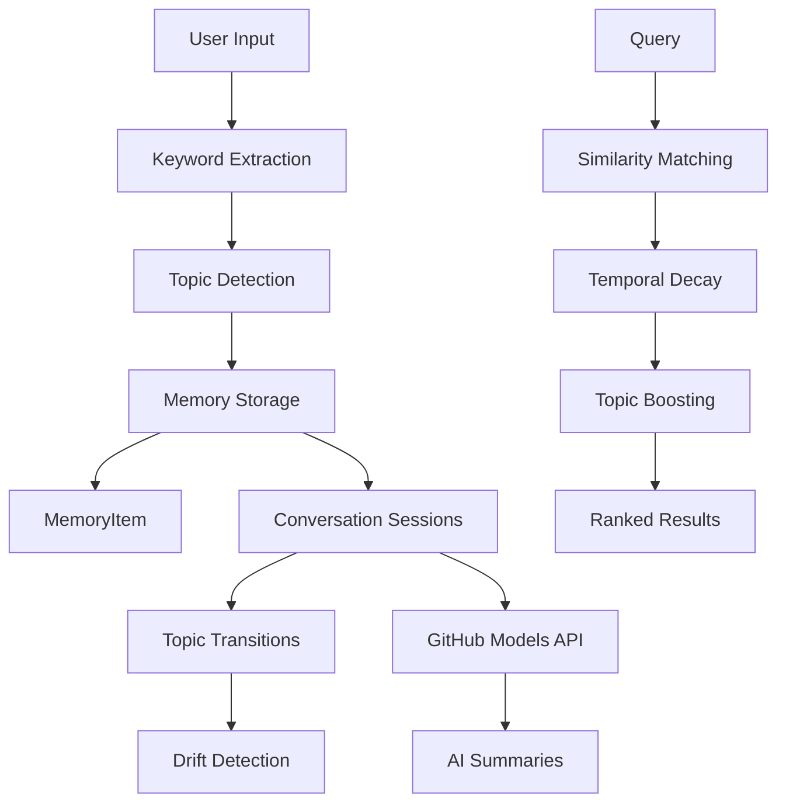

# 🧠 LLM Memory Concepts

> A sophisticated memory management system for conversational AI that mimics human-like memory formation, retrieval, and organization.

[](https://python.org)
[](https://github.com/marketplace/models)
[](LICENSE)

## 🌟 Features

### 🔍 **Intelligent Memory Storage**
- **Automatic keyword extraction** with smart stop-word filtering
- **Dynamic topic detection** and clustering
- **Temporal decay** - older memories naturally fade in relevance
- **Access pattern tracking** - frequently retrieved memories stay relevant

### 🎯 **Context-Aware Retrieval**
- **Semantic similarity matching** using Jaccard similarity
- **Topic-boosted scoring** for thematically related content
- **Relevance ranking** with configurable minimum thresholds
- **Top-K retrieval** for focused context windows

### 📊 **Conversation Analytics**
- **Topic drift detection** - identifies when conversations shift themes
- **Conversation summarization** using GitHub Models API
- **Split conversations** by topic or manual breakpoints
- **Memory analytics** with keyword co-occurrence tracking

### 🤖 **AI Integration**
- **GitHub Models API** integration for intelligent summaries
- **Multiple model support** (GPT-4o-mini, GPT-4o, etc.)
- **Robust error handling** with fallback responses
- **Secure token management** via environment variables

## 🚀 Quick Start

### Prerequisites
```bash
pip install requests python-dotenv
```

### Setup
1. **Get your GitHub Models token** from [GitHub Models](https://github.com/marketplace/models)

2. **Create environment file:**
```bash
# Create .env file in project root
echo "GH_TOKEN=your_github_pat_token_here" > .env
```

3. **Run the demo:**
```python
python run_demo.py
```

## 📋 Usage Examples

### Basic Memory Operations
```python
from memory_stream_agent import MemoryStreamAgent

# Initialize the agent
agent = MemoryStreamAgent()

# Add memories to a conversation
result = agent.add_message(
    "I'm planning a trip to Tokyo next month", 
    conversation_id="user123"
)
print(f"Detected topic: {result['topic']}")
print(f"Keywords: {result['keywords']}")

# Retrieve relevant context
context = agent.get_relevant_context("What about my Japan travel plans?")
for item in context:
    print(f"[{item['topic']}] {item['content']} (score: {item['score']})")
```

### Advanced Features
```python
# Generate AI summary of conversation
summary = agent.create_openai_summary("user123")
print(f"AI Summary: {summary}")

# Split conversation by topics
topic_groups = agent.split_conversation_by_topic("user123")
for topic, messages in topic_groups.items():
    print(f"Topic '{topic}': {len(messages)} messages")

# Detect topic drift
drift = agent.emit_topic_drift_event()
if drift:
    print(f"🚨 {drift}")
```

## 🏗️ Architecture



## 📁 Project Structure

```
llm_memory_concepts/
├── 📄 memory_stream_agent.py    # Core memory management system
├── 🚀 run_demo.py              # Demonstration script
├── ⚙️ topic_keywords.json       # Dynamic topic clusters (auto-generated)
├── 🔐 .env                     # Environment variables (create this)
├── 📚 README.md                # This file
└── 🚫 .gitignore              # Git ignore rules
```

## 🧪 Core Components

### `MemoryItem` 📝
Individual memory units containing:
- **Content**: The actual text/message
- **Keywords**: Extracted semantic markers
- **Timestamp**: When the memory was created
- **Access patterns**: How often it's retrieved
- **Topic tags**: Thematic categorization
- **Conversation ID**: Session grouping

### `MemoryStreamAgent` 🤖
The main orchestrator featuring:
- **Dynamic topic clustering** with auto-save
- **Similarity-based retrieval** with temporal weighting
- **Conversation session management**
- **GitHub Models API integration**
- **Topic drift analysis**

## ⚙️ Configuration

### Environment Variables
| Variable | Description | Required |
|----------|-------------|----------|
| `GH_TOKEN` | GitHub Models API token | ✅ Yes |

### Model Options
- `gpt-4o-mini` (default, cost-effective)
- `gpt-4o` (higher capability)
- `gpt-4` (legacy support)

## 🎨 Example Output

```bash
📥 Added message. Topic: travel, Keywords: ['tokyo', 'planning', 'trip', 'month']

🔍 Relevant context:
- [travel] I'm planning a trip to Tokyo next month (score: 0.87)
- [food] I want to try authentic ramen while traveling (score: 0.42)

🚨 Topic drift: work → travel

📊 Conversation Summary:
{
  "total_messages": 5,
  "topics": ["travel", "food", "work"],
  "keywords": ["tokyo", "ramen", "planning", "project"],
  "start_time": "2025-07-25T12:31:42.759932",
  "end_time": "2025-07-25T12:45:18.123456"
}

🤖 AI Summary: The user discussed travel plans to Tokyo, expressing interest in experiencing local cuisine, particularly ramen, while managing work commitments.
```

## 🤝 Contributing

1. Fork the repository
2. Create a feature branch (`git checkout -b feature/amazing-feature`)
3. Commit your changes (`git commit -m 'Add amazing feature'`)
4. Push to the branch (`git push origin feature/amazing-feature`)
5. Open a Pull Request

## 📄 License

This project is licensed under the MIT License - see the [LICENSE](LICENSE) file for details.

## 🔗 Related Projects

- [GitHub Models](https://github.com/marketplace/models) - AI model marketplace
- [LangChain](https://github.com/langchain-ai/langchain) - LLM application framework
- [AutoGPT](https://github.com/Significant-Gravitas/AutoGPT) - Autonomous AI agents

## 🙏 Acknowledgments

- Built with ❤️ using GitHub Models API
- Inspired by human memory formation and retrieval patterns
- Thanks to the open-source AI community

---

<div align="center">
  <strong>🧠 Making AI remember like humans do</strong>
</div>
